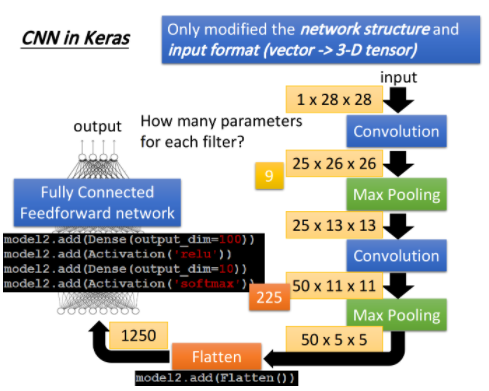

[toc]


# Convolutional Neural network

## Why CNN for image?

### CNN vs DNN

我们可以用一般的neural network做图像处理，会遇到问题，**我们直接用一般的fully connected和feedforward network会需要太多的参数**。


比如一张100*100的图片，它的vector的size是 100 * 100 * 3,也就是说input vector就是3万维，假设hidden layer有1000个neuron，那么仅仅第一层就有30000 * 1000 个参数。

所以CNN做的事情是**简化neural network的架构，根据我们自己的知识将一些实际上用不到的参数过滤掉，不用fully connected network，而是用比较少的参数实现图像处理**，所以CNN比DNN更加简单。

### Three Property for CNN theory base

怎么过滤参数呢？有一下三个对于图像处理的观察：（**CNN架构提出的基础**）

> Some patterns are much smaller than the whole image

假设第一层hidden layer里，neuron做的事情是探测有没有一种pattern(图片样式，比如小鸟的鸟嘴)，我们知道这样的pattern是比整张图片小的，所以实际上neuron只需要看一张图的小部分，也就是说**每一个neuron要探测的部分更小对应更少的参数**。


> The same patterns appear in different regions

同样的pattern可能出现在图片的不同部分，但是它们的形状相同，含义相同，应该是可以用同一个neuron，同样的参数，被同一个detector检测出来


我们可以训练一个neuron，detector来做检测同一个pattern的工作，**它们可以共用一组参数，从而减少总参数的数量**。

> Subsampling the pixels will not change the object

我们可以对一张图片进行subsampling(二次抽样)，比如将图片的某些数量的行列拿掉，图片会变小，但是不影响人对图的理解。


通过subsampling可以将图片变小，减少参数的数量。

## The whole CNN structure

整个CNN的架构，首先输入一张图片，它会通过Convolution的layer，然后做max pooling(最大池取样)然后重复两个步骤多次(**次数提前设定**)，做完Convolution、Max Pooling后进行Flatten,做完Flatten以后将output丢到fully connected network里面去，最终得到图像处理的结果。


我们基于之前提到的对三个图像处理的观察，设计了CNN架构，第一个是探测pattern，只需要探测图片的一个小部分，第二个是同样的pattern会出现在不同的部分,第三个是可以对图片进行subsampling。

对于前二者，用Convolution的layer处理，第三个用max pooling处理。


### Convolution

假设有一张6*6的图片作为输入，图片是黑白的，每个pixel中1代表黑色，在Convolution layer里面，有一堆filter,每一个filter实际上等同于fully connected layer里面的一个neuron。

#### property1

 

每个filter实际上是一个matrix，matrix里面每个element的值是network的参数，是根据训练集训练出来的。上图中每个filter是3*3的size，这代表它在探测一个3 * 3的pattern，**它在探测时候只看图片中3 * 3个pixel的区域**。

#### property2

filter从左上角开始，做slide window，每次向右边移动一定距离(stride),距离大小需要设计，每次filter停下的时候与对应的matrix做内积(相同位置相乘，并且累加求和)，这里假设stride=1，filter每次移动1格，当它碰到图片最右边，就从下一行最左边继续上诉操作，经过整个Convolution的处理，最终得到下图红色的4*4的matrix，观察可以知道，filter的作用就是检测有没有连续的从左上角到右下角的1，1，1，此时filter的卷积结果在左上角和左下角出现最大值，这就代表说filter探测的pattern出现在图片的左上角和右下角。

**我们探测到同一个pattern在图片的左上角和右下角，用了同一个filter，这与property2的考虑一样**。

#### Feature Map

在一个Convolution的layer里面，有很多filter，不同的filter有不同的参数，但是它们做卷积的过程是一样的，你用filter2和image做完Convolution以后，会得到另外一个蓝色的matrix,这个蓝色的matrix和之前的红色的matrix合起来，就叫做Feature Map(特征映射)，有多少个filter就有多少个映射后的image。


**CNN对不同scale的相同pattern处理存在一定的困难**，由于每个filter的size是一样的，这意味着如果你有同一个pattern，但是它的size不同，有大的鸟嘴也有小的鸟嘴，CNN不能自动处理这个问题。DeepMind曾经发过一篇paper，上面提到当你输入一张图片的时候它在CNN前面接另外一个network，这个network会输出一些scalar，告诉你把这个image里面的哪些位置做旋转、缩放，然后丢到CNN里面会得到比较好的performance。

#### Colorful image

对于彩色的image，彩色的image是由RGB组成的，你input的是好几个matrix叠在一起的一个立方体。


对应的filter也要变成一个立方体，如果用RGB三个颜色表示一个pixel,input会是3 * 6 * 6，你的filter会是3 * 3 * 3,filter的高是3，在做convolution的时候就是将filter的9个值和image的9个值进行内积，可以想象成filter的每一层都和分别image的三层做内积，得到的也是一个三层的output，每一个filter同时就考虑到了不同颜色代表的channel。

### Convolution vs Fully connected

#### filter是特殊的“neuron”

convolution实际上就是一个neural network，是一个fully connected的layer将一些weight拿掉(置0),下图绿色框框标识出来的filter map的output，实际上是hidden layer的neuron的output


接下来我们解释这件事情：

如下图所示，我们做convolution的时候，将filter放在图片的左上角，做内积得到一个值3，这件事情等同于将image的matrix拉直变成右边一排用作input的vector，然后你有一个红色的neuron，这些input经过neuron之后得到的output是3


#### 每个“neuron”只检测image的部分区域

这个neuron的output怎么来呢？实际上这个neuron实际上由filter转化而来，我们将filter放在image的左上角，filter对应考虑和image重合的9个pixel，假设你将这个6 * 6的36个pixel拉直的vector作为输入，那么这9个pixel就对应右边编号位1，2，3，7，8，9，13，14，15的pixel

这个filter和image matrix做内积得到3，就是input vector经过某个neuron得到output 3，就是说存在一个neuron，这个neuron带weight的连线只连接到上一段说的编号的9个pixel，weight的值对应filter matrix上的9个数值

作为对比，fully connected的neuron是必须连接36个input上的，但是现在我们只需要连接9个input，因为我们知道探测一个pattern只需要看3个input pixel，所以我们减少了参数的使用。

#### “neuron”之间共享参数

当我们把filter做stride = 1的移动时，我们通过filter和image matrix的内积得到另外一个output值-1，假设这个-1是另外一个neuron的output，这个neuron会连接到的input对应pixel 2，3，4，8，9，10，14，15，16


output为3和-1的两个neuron，它们分别检测在image的不同位置是否存在某个pattern，因为在fully connected layer它们做的事情不同应该有自己独立的weight

但是我们做convolution的时候，我们首先将每个neuron前面连接的weight减少了，然后强迫某些neuron(比如上一段的两个neuron)一定要共享一组weight，虽然两个neuron连接的pixel对象不同但是它们用的weight是一样的，等于filter里面的元素值，这就叫做weight share，又一次减少了参数的使用

#### 总结

我们可以这么思考，有一些特殊的neuron，它们只连接9条带着weight的线(9=3 * 3对应filter matrix的元素个数，weight是元素值，上图圆圈的颜色和连线的颜色一一对应)

当filter在image matrix上移动做convolution的时候，每次移动都是检测这个地方有没有某个pattern，对于fully connected layer是要对整个image进行检测的，所以每次检测image不同地方是否有pattern是不同的事情，这些neuron必须连接到整张image的所有pixel上，并且不同的neuron连线上的weight是相互独立的。

**对于Convolution layer来说，首先它是对image一部分做检测，因此它的neuron只需要连接image部分的pixel，对应连线所需要的weight参数就会减少，其次由于是用同一个filter检测不同位置的pattern，所以对应Convolution layer是同一件事情，不同的neuron连接的pixel对象不同，但是在“做同一件事情”的前提下，也就是用同一个filter的前提下，这些neuron所用的weight参数是相同的，通过weight share的方式减少了network所需要用到的weight参数。CNN本质是减少参数的过程。**

#### 补充

CNN怎么搭建和train呢？

首先，第一件事情就是这都是用toolkit做的，所以你大概不会自己去写；如果你要自己写的话，它其实就是跟原来的Backpropagation用一模一样的做法，只是有一些weight永远是0，你就不去train它，它就永远是0

然后，怎么让某些neuron的weight值永远都是一样呢？你就用一般的Backpropagation的方法，对每个weight都去算出gradient，再把本来要tight在一起、要share weight的那些weight的gradient平均，然后，让他们update同样值就ok了

### Max Pooling

#### Operation of max pooling

max pooling是用来做subsampling的，根据filter1，我们得到一个4 * 4的matrix，根据filter2，我们得到另外一个4 * 4的matrix

接下来我们把output四个分为一组，每一组通过取平均值或者最大值的方式将4个value合成一个value，这件事情相当于在image每相邻的四块区域都挑出一块来检测，这样的subsampling方式将image缩小了


取Maximum放到network里面，是可以对它微分的，后面会讲Maxout network，用微分的方式处理它

### Convolution + Max Pooling

做完一次convolution+max pooling，我们就把原来的6 * 6的image变成了2 * 2的image。而这个2 * 2的image，它的每一个pixel深度，也就是每个pixel用几个value表示，取决于你有几个filter，如果有50个filter，就有50维，像下图是两个filter，对应深度就是二维。

所以，这是一个新的比较小的image，它表示的是不同区域提取到的特征，实际上不同的filter检测的是该image同一区域的不同特征属性，所以每一层的channel代表一种属性，一块区域有几种不同的属性，就有几种不同的channel，对应的就会有几个不同的filter对其进行convolution操作


这种事情可以重复多次，你把这个得到的更小的image，再次进行convolution和max pooling操作，得到更小的image，以此类推

问题：假设我第一个convolution有25个filter，通过这些filter得到25个feature map,然后重复的时候第二个convolution也有25个filter，那这样做完，是不是会得到25^2个feature map？

答案其实不是的，你做完一次convolution得到25个feature map之后在做一次convolution，还是会得到25个feature map，因为convolution在考虑input的时候，是会考虑深度的，也就是第二层convolution不会将每一个channel分开考虑，会一次性考虑所有的channel，所以你convolution有多少个filter，再次output的时候就会有多少个channel

因为有25个filter，经过含有25个filter的convolution后ouput还是25个channel，只是每个channel都是一个cubic(立方体)，它的高有25个value那么高


### Flatten

做完convolution和max pooling之后，就是FLatten和Fully connected Feedforward network的部分

Flatten的意思是，把左边的feature map拉直，然后把它丢进一个Fully connected Feedforward network，然后就结束了，也就是说，我们之前通过CNN提取出了image的feature，它相较于原先一整个image的vetor，少了很大一部分内容，因此需要的参数也大幅度地减少了，但最终，也还是要丢到一个Fully connected的network中去做最后的分类工作


## CNN in Keras

### keras implement CNN

实际上在compile、training和fitting部分，内容和DNN是一模一样的，对于CNN来说唯一需要改变的是net work的结构以及input的format

在DNN中，input是一个由image拉直展开而成的vector，但是如果是CNN的话，他会考虑input image的几何空间，所以不能直接input一个vector，而是要input一个tensor(tensor是一个高维的vector)，这里你要给它一个三维的vector，一个image的长宽各是一维，如果它是彩色的，RGB是第三维，所以你需要assign一个三维matrix，这个matrix就是tensor


那么怎么implement一个convolution的layer呢？

``` model2.add( Convolution2D(25,3,3, input_shape=(28,28,1)) )```

用```model.add```增加CNN的layer，将原先的Dense改成Convolution2D,参数25代表有25个filter，参数3，3代表filter都是3 * 3的matrix，此外还要告诉model你的input的image的shape是什么样子。例如我现在在做手写数字识别，input就是28 * 28的image，又因为它的每一个pixel都只有单一颜色，因此```input_shape```的值就是(28,28,1)，如果是RGB的话，1需要改成3

然后增加一层Max Pooling的layer

```model2.add(MaxPooling2D(2,2))```

这里参数(2,2)的意思是，我们把通过convolution得到的feature map，按照2 * 2的方式分割成一个一个区域，每次选取最大的那个值，然后将这些值组成一个新的比较小的image，作为subsampling的结果

#### 过程描述

* 假设我们的input是一个28 * 28的image
* 通过25个filter的convolution layer之后得到的output，会有25个channel，又因为filter的size是3 * 3，因此不考虑image边缘处的处理的话，得到的channel会是26 * 26的，因此通过第一个convolution得到25 * 26 * 26(这里将这种image想象成长宽为26，高为25的cubic立方体，如果想保留边缘部分就在外围补0)
* 接下来做max pooling，把2 * 2的pixel分为一组，然后从里面选一个最大的组成新的image，大小为25 * 13 * 13(cubic长宽各被砍掉一半)
* 再做一次convolution，假设这次选择50个filter，每个filter size是3 * 3的话，output的channel就变成50个，那13 * 13的image，经过3 * 3的filter，就会变成11 * 11，因此通过第二个filter得到50 * 11 * 11的image(得到一个新的长宽为11，高为50的cubic)
* 再做一次Max Pooling，变成50 * 50 * 5


在第一个convolution里面，每一个filter都有9个参数，它就是一个3 * 3的matrix,但是在第二个convolution layer里面，虽然每个filter都是3 * 3，但它其实不是3 * 3个参数，因为它的input是一个25 * 13  * 13的cubic，这个cubic的channel有25个，所以要用同样高度的cubic filter对它进行卷积，所以我们的filter实际上是一个25 * 3 * 3的cubic，所以这边每个filter共有225个参数



通过两次convolution和max pooling的组合，最终image变成50 * 5 * 5的size，然后使用flatten将这个image拉直，变成一个1250维的vector，再把它丢到一个fully connecttd feedforward network里面，net structure就搭建完成了

#### 一个重要的问题

看到这里，你可能会有一个疑惑，第二次convolution的input是25*13*13的cubic，用50个3*3的filter卷积后，得到的输出时应该是50个cubic，且每个cubic的尺寸为25*11*11，那么max pooling把长宽各砍掉一半后就是50层25*5*5的cubic，那flatten后不应该就是50*25*5*5吗？

其实不是这样的，在第二次做convolution的时候，我们是用25*3*3的cubic filter对25*13*13的cubic input进行卷积操作的，filter的每一层和input cubic中对应的每一层(也就是每一个channel)，它们进行内积后，还要把cubic的25个channel的内积值进行求和，作为这个“neuron”的output，它是一个scalar，这个cubic filter对整个cubic input做完一遍卷积操作后，得到的是一层scalar，然后有50个cubic filter，对应着50层scalar，因此最终得到的output是一个50*11*11的cubic！

这里的关键是filter和image都是cubic，每个cubic filter有25层高，它和同样有25层高的cubic image做卷积，并不是单单把每个cubic对应的channel进行内积，还会把这些内积求和！！！最终变为1层，因此**两个矩阵或者tensor做了卷积后，不管之前的维数如何，都会变为一个scalor！**，故如果有50个Filter，无论input是什么样子的，最终的output还会是50层

#### Appendix：CNN in Keras2.0

这里还是举**手写数字识别**的例子，将单纯使用DNN和加上CNN的情况作为对比

##### code

```python
import numpy as np
from keras.models import Sequential
from keras.layers import Convolution2D, MaxPooling2D, Flatten, Conv2D
from keras.layers.core import Dense, Dropout, Activation
from keras.optimizers import SGD, Adam
from keras.utils import np_utils
from keras.datasets import mnist

# categorical_crossentropy


def load_mnist_data(number):
    # the data, shuffled and  split between train and test sets
    (x_train, y_train), (x_test, y_test) = mnist.load_data()
    x_train = x_train[0:number]
    y_train = y_train[0:number]
    x_train = x_train.reshape(number, 784)
    x_test = x_test.reshape(10000, 784)
    x_train = x_train.astype('float32')
    x_test = x_test.astype('float32')
    # convert class vectors to binary class matrices
    y_train = np_utils.to_categorical(y_train, 10)
    y_test = np_utils.to_categorical(y_test, 10)
    x_train = x_train / 255
    x_test = x_test / 255

    return (x_train, y_train), (x_test, y_test)


if __name__ == '__main__':
    (x_train, y_train), (x_test, y_test) = load_mnist_data(10000)

    # do DNN
    model = Sequential()
    model.add(Dense(input_dim=28 * 28, units=500, activation='relu'))
    model.add(Dense(units=500, activation='relu'))
    model.add(Dense(units=500, activation='relu'))
    model.add(Dense(units=10, activation='softmax'))
    model.summary()

    model.compile(loss='categorical_crossentropy',
                  optimizer='adam', metrics=['accuracy'])

    model.fit(x_train, y_train, batch_size=100, epochs=20)

    result_train = model.evaluate(x_train, y_train)
    print('\nTrain Acc:\n', result_train[1])

    result_test = model.evaluate(x_test, y_test)
    print('\nTest Acc:\n', result_test[1])

    # do CNN
    x_train = x_train.reshape(x_train.shape[0], 1, 28, 28)
    x_test = x_test.reshape(x_test.shape[0], 1, 28, 28)

    model2 = Sequential()
    model2.add(Conv2D(25, (3, 3), input_shape=(
        1, 28, 28), data_format='channels_first'))
    model2.add(MaxPooling2D((2, 2)))
    model2.add(Conv2D(50, (3, 3)))
    model2.add(MaxPooling2D((2, 2)))
    model2.add(Flatten())
    model2.add(Dense(units=100, activation='relu'))
    model2.add(Dense(units=10, activation='softmax'))
    model2.summary()

    model2.compile(loss='categorical_crossentropy',
                   optimizer='adam', metrics=['accuracy'])

    model2.fit(x_train, y_train, batch_size=100, epochs=20)

    result_train = model2.evaluate(x_train, y_train)
    print('\nTrain CNN Acc:\n', result_train[1])
    result_test = model2.evaluate(x_test, y_test)
    print('\nTest CNN Acc:\n', result_test[1])

```

##### result

###### DNN

```python
Using TensorFlow backend.
_________________________________________________________________
Layer (type)                 Output Shape              Param #   
=================================================================
dense_1 (Dense)              (None, 500)               392500    
_________________________________________________________________
dense_2 (Dense)              (None, 500)               250500    
_________________________________________________________________
dense_3 (Dense)              (None, 500)               250500    
_________________________________________________________________
dense_4 (Dense)              (None, 10)                5010      
=================================================================
Total params: 898,510
Trainable params: 898,510
Non-trainable params: 0
_________________________________________________________________
Epoch 1/20
10000/10000 [==============================] - 2s 207us/step - loss: 0.4727 - acc: 0.8643
Epoch 2/20
10000/10000 [==============================] - 1s 149us/step - loss: 0.1613 - acc: 0.9521
Epoch 3/20
10000/10000 [==============================] - 2s 159us/step - loss: 0.0916 - acc: 0.9726
Epoch 4/20
10000/10000 [==============================] - 2s 173us/step - loss: 0.0680 - acc: 0.9769
Epoch 5/20
10000/10000 [==============================] - 2s 166us/step - loss: 0.0437 - acc: 0.9850
Epoch 6/20
10000/10000 [==============================] - 2s 166us/step - loss: 0.0274 - acc: 0.9921
Epoch 7/20
10000/10000 [==============================] - 2s 168us/step - loss: 0.0265 - acc: 0.9892
Epoch 8/20
10000/10000 [==============================] - 2s 161us/step - loss: 0.0240 - acc: 0.9916
Epoch 9/20
10000/10000 [==============================] - 2s 169us/step - loss: 0.0149 - acc: 0.9950
Epoch 10/20
10000/10000 [==============================] - 2s 155us/step - loss: 0.0258 - acc: 0.9933
Epoch 11/20
10000/10000 [==============================] - 2s 168us/step - loss: 0.0206 - acc: 0.9934
Epoch 12/20
10000/10000 [==============================] - 2s 161us/step - loss: 0.0132 - acc: 0.9955
Epoch 13/20
10000/10000 [==============================] - 2s 168us/step - loss: 0.0113 - acc: 0.9964
Epoch 14/20
10000/10000 [==============================] - 2s 169us/step - loss: 0.0027 - acc: 0.9991
Epoch 15/20
10000/10000 [==============================] - 2s 157us/step - loss: 6.6533e-04 - acc: 0.9999
Epoch 16/20
10000/10000 [==============================] - 1s 150us/step - loss: 1.1253e-04 - acc: 1.0000
Epoch 17/20
10000/10000 [==============================] - 2s 152us/step - loss: 8.3190e-05 - acc: 1.0000
Epoch 18/20
10000/10000 [==============================] - 2s 174us/step - loss: 6.7850e-05 - acc: 1.0000
Epoch 19/20
10000/10000 [==============================] - 2s 173us/step - loss: 5.6810e-05 - acc: 1.0000
Epoch 20/20
10000/10000 [==============================] - 2s 172us/step - loss: 4.8757e-05 - acc: 1.0000
        
10000/10000 [==============================] - 1s 97us/step
Train Acc: 1.0
10000/10000 [==============================] - 1s 77us/step
Test Acc: 0.9661
```

###### CNN

```python
_________________________________________________________________
Layer (type)                 Output Shape              Param #   
=================================================================
conv2d_1 (Conv2D)            (None, 25, 26, 26)        250       
_________________________________________________________________
max_pooling2d_1 (MaxPooling2 (None, 12, 13, 26)        0         
_________________________________________________________________
conv2d_2 (Conv2D)            (None, 10, 11, 50)        11750     
_________________________________________________________________
max_pooling2d_2 (MaxPooling2 (None, 5, 5, 50)          0         
_________________________________________________________________
flatten_1 (Flatten)          (None, 1250)              0         
_________________________________________________________________
dense_5 (Dense)              (None, 100)               125100    
_________________________________________________________________
dense_6 (Dense)              (None, 10)                1010      
=================================================================
Total params: 138,110
Trainable params: 138,110
Non-trainable params: 0
_________________________________________________________________
Epoch 1/20
10000/10000 [==============================] - 8s 785us/step - loss: 0.6778 - acc: 0.8113
Epoch 2/20
10000/10000 [==============================] - 7s 734us/step - loss: 0.2302 - acc: 0.9349
Epoch 3/20
10000/10000 [==============================] - 8s 765us/step - loss: 0.1562 - acc: 0.9532
Epoch 4/20
10000/10000 [==============================] - 8s 760us/step - loss: 0.1094 - acc: 0.9680
Epoch 5/20
10000/10000 [==============================] - 8s 843us/step - loss: 0.0809 - acc: 0.9763
Epoch 6/20
10000/10000 [==============================] - 7s 748us/step - loss: 0.0664 - acc: 0.9810
Epoch 7/20
10000/10000 [==============================] - 8s 764us/step - loss: 0.0529 - acc: 0.9832
Epoch 8/20
10000/10000 [==============================] - 7s 747us/step - loss: 0.0370 - acc: 0.9904
Epoch 9/20
10000/10000 [==============================] - 7s 687us/step - loss: 0.0302 - acc: 0.9919
Epoch 10/20
10000/10000 [==============================] - 7s 690us/step - loss: 0.0224 - acc: 0.9940
Epoch 11/20
10000/10000 [==============================] - 7s 698us/step - loss: 0.0177 - acc: 0.9959
Epoch 12/20
10000/10000 [==============================] - 7s 690us/step - loss: 0.0154 - acc: 0.9965
Epoch 13/20
10000/10000 [==============================] - 7s 692us/step - loss: 0.0126 - acc: 0.9962
Epoch 14/20
10000/10000 [==============================] - 7s 689us/step - loss: 0.0130 - acc: 0.9966
Epoch 15/20
10000/10000 [==============================] - 7s 691us/step - loss: 0.0092 - acc: 0.9977
Epoch 16/20
10000/10000 [==============================] - 7s 691us/step - loss: 0.0067 - acc: 0.9986
Epoch 17/20
10000/10000 [==============================] - 7s 687us/step - loss: 0.0069 - acc: 0.9985
Epoch 18/20
10000/10000 [==============================] - 7s 691us/step - loss: 0.0040 - acc: 0.9995
Epoch 19/20
10000/10000 [==============================] - 7s 745us/step - loss: 0.0020 - acc: 1.0000
Epoch 20/20
10000/10000 [==============================] - 8s 782us/step - loss: 0.0014 - acc: 1.0000

10000/10000 [==============================] - 7s 657us/step
Train CNN Acc: 1.0
10000/10000 [==============================] - 5s 526us/step
Test CNN Acc: 0.98
```

## What does CNN learn?

### what is intelligent?

如果今天有一个方法，它可以让你轻易地理解为什么这个方法会下这样的判断和决策的话，那其实你会觉得它不够intelligent；它必须要是你无法理解的东西，这样它才够intelligent，至少你会感觉它很intelligent

所以，大家常说deep learning就是一个黑盒子，你learn出来以后，根本就不知道为什么是这样子，于是你会感觉它很intelligent，但是其实还是有很多方法可以分析的，今天我们就来示范一下怎么分析CNN，看一下它到底学到了什么


要分析第一个convolution的filter比较容易，因为第一个convolution layer里面，每一个filter就是一个3 * 3的matrix，它对应到3 * 3范围内的9个pixel，所以你只要看这个filter的值就可以知道它再探测什么东西，因此第一层的filter是很容易理解的

但是你比较无法想象第二层的filter在做什么事情，它们是50个同样为3 * 3的filter，但是这些filter的input并不是pixel，而是做完convolution再做Max Pooling的结果，因此filter考虑的范围并不是3 * 3=9个pixel而是一个长宽为3 * 3，高为25的cubic，filter实际在image上看到的范围是远大于9个pixel的，所以你就算把它的weight拿出来，也不知道它在做什么

### what does filter do?

我们知道第二个convolution layer里面的50个filter，每一个filter的output就是一个11 * 11的matrix，假设我们现在把第k个filter的output拿出来，如下图所示，这个matrix里面的每一个element，我们叫它$a_{ij}^k$,上标k表示这是第k个filter，下标表示它在这个matrix里的第i个row，第j个column


接下来我们define一个$a^k$叫做Degree  of the activation of the k-th filter,这个值表示现在的第k个filter，它有多被activate，有多被“启动”，直观来讲就是描述现在input的东西和第k个filter有多接近，它对filter的激活程度有多少。

第k个filter被启动的degree$a^k$就定义成，它与input进行卷积所输出的output里所有element的summation，以上图为例，就是这11*11的output matrix里所有元素之和，用公式描述如下：
$$
a^k = \sum_{i=1}^{11} \sum_{j=1}^{11} a_{ij}^k
$$


也就是说，我们input一张image，然后把这个filter和image进行卷积所output的11*11个值全部加起来，当作现在这个filter被activate的程度

我们想要知道第k个filter的作用是什么，我们就要找一张image，它使得第k个filter被activate的程度最大，于是我们要做的事情就是找到一个image x,它可以让我们定义的activation的degree $a^k$最大，即：
$$
x^* = \arg \max_{x} a^k
$$
之前我们求minimize用的是gradient descent，那现在我们求Maximum用gradient ascent就可以做到这个事情

我们现在是把input x作为要找的参数，对它去用gradient descent或者ascent进行update，原来在train CNN的时候，input是固定的，model的参数用gradient descent找出来，现在要做的事情是相反的，model的参数固定，用gradient ascent去update这个x使得degree of activation最大


上图是得到的结果，50个filter理论上可以分别找50张图片使得对应的activation最大，这里只挑选了其中的12张image作为展示，这些image有一个共同的特征，它们里面都是一些**反复出现的某些texture(纹路)**，比如第三张image布满了小小的斜条纹，这意味着第三个filter的工作就是detect图上有没有小小的斜条纹，每个filter检测的都是图中的一个小小的范围，一旦图中有小小的斜条纹，这个filter就会被activate，相应的output也会比较大，当整张图片都说小小的斜条纹的时候它的activation最大，相应的output会达到最大

因此每个filter的工作就是detect某一种pattern，上图的filter所detect的就是不同角度的线条，所以今天input有不同线条的话，某一个filter会去找到一个让它兴奋度最高的匹配对象，这个时候它的output是最大的

### what does neuron do？


